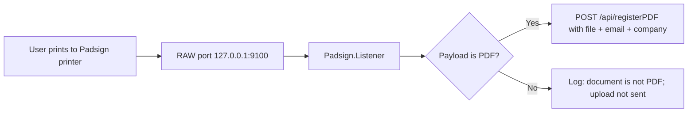

Padsign Virtual Printer Client
==============================

This solution installs a virtual printer named `Padsign` on Windows and uploads print jobs to Padsign API when the incoming print payload is already a PDF.

No manual config-file editing is required for end users. All operational fields are editable in the desktop app (`Padsign Manager`).

Visual Architecture
-------------------

UI Map (What Client Sees)
-------------------------
- Header chips:
  - `Config: ...`
  - `Listener: Running/Stopped`
  - `Printer: Installed/Missing`
- Tabs:
  - `Setup`: fill API/auth/session values and click `Save And Test PDF Sending`.
  - `Operations`: install/remove printer, start/stop listener, readiness checklist, command output.
  - `Monitoring`: live log tail, copy log, clear output.
- Help:
  - `?` button in top-right opens built-in troubleshooting guide.

Detailed Tab Guide
------------------
Setup Tab
- Purpose:
  - configure API/auth/session values and verify upload before starting listener.
- Left-side fields:
  - `API URL`
  - `Authentication Header Name`
  - `Authentication Header Value` with `Show` checkbox and `Copy` button
  - `Email`
  - `Company`
- Right-side fields:
  - `RAW Port`
  - `Working Directory`
  - `Upload Timeout Seconds`
  - `Max Upload Retries`
  - `Retry Backoff Seconds`
  - `Cleanup spool files after successful upload`
- Actions:
  - `Save And Test PDF Sending`:
    - validates input
    - persists configuration
    - sends a test PDF upload with current `email + company`
    - returns friendly error category plus technical details on failure
  - `Remove PDF`:
    - calls remove-user endpoint for current `email + company`
- Setup status texts:
  - save state (`Unsaved changes` or `Saved`)
  - last upload test state (`success/failed/not run`)

Operations Tab
- Purpose:
  - runtime control plane for printer/listener and operational checks.
- Environment card:
  - shows resolved paths for root, config, listener executable, and log file.
- Readiness checklist:
  - config is valid and saved
  - printer is installed
  - listener process is running
  - API test upload has succeeded
- Actions section:
  - `Install Printer (Admin)`:
    - creates/repairs local Padsign printer and RAW TCP port
  - `Start Listener` / `Stop Listener`:
    - one toggle button depending on current state
  - `! Remove Printer (Risky)`:
    - removes local Padsign printer after confirmation
- Diagnostics panels:
  - `Last Operation` card summarizes latest command/action result
  - `Command Output` shows command/API diagnostics details

Monitoring Tab
- Purpose:
  - real-time log visibility and support diagnostics.
- Behavior:
  - auto-refreshes while Monitoring tab is open
  - shows listener log tail in a console-style panel
- Actions:
  - `Refresh Log`
  - `Copy Log`
  - `Clear Output`
- Recommended usage:
  - open this tab during first print tests to confirm upload flow and errors.

Screenshots
-----------
Use these names for client screenshots in this README:
- `docs/images/setup-tab.png`
- `docs/images/operations-tab.png`
- `docs/images/monitoring-tab.png`
- `docs/images/help-window.png`

When image files are added, include:

### Setup Tab

### Operations Tab

### Monitoring Tab

### Help Window

Install and First Run (Client)
------------------------------
1. Run `Padsign-Setup.cmd` as Administrator.
2. In setup window:
   - choose installation folder
   - choose whether to create desktop shortcut
3. App opens `Padsign Manager`.
4. In `Setup` tab fill:
   - `ApiUrl`
   - `Authentication Header Name`
   - `Authentication Header Value`
   - `Email`
   - `Company`
5. Click `Save And Test PDF Sending`.
6. Open `Operations` tab and click `Start Listener`.
7. Print to printer `Padsign`.

Required Fields
---------------
- `ApiUrl`
- `AuthenticationHeaderName`
- `AuthenticationHeaderValue`
- `Email`
- `Company`

Advanced Fields
---------------
- `Port` (default `9100`)
- `WorkingDirectory` (default `spool`)
- `UploadTimeoutSeconds`
- `MaxUploadRetries`
- `RetryBackoffSeconds`
- `CleanupOnSuccess`

Runtime Behavior
----------------
- PDF payload:
  - uploaded to Padsign API (`registerPDF`) with `file`, `email`, `company`.
- Non-PDF payload:
  - request is not sent
  - listener logs: `document is not PDF. Upload request has not been made.`
- `Remove PDF` button:
  - calls remove-user API using current `email + company`.

Status and Readiness
--------------------
Operations tab checklist expects all to be true:
- valid and saved configuration
- virtual printer installed
- listener running
- successful API test upload in current config context

Troubleshooting (Client-Friendly)
---------------------------------
- `Could not connect`:
  - API URL unavailable, DNS/network issue, firewall/proxy issue.
- `Authorization error` (`401/403`):
  - header name/value invalid or expired token.
- `Bad request` (`400`):
  - check URL endpoint and `email/company` values.
- `Listener executable not found`:
  - broken installation; reinstall with latest package.
- Printer installed but button flow inconsistent:
  - reopen app; statuses refresh automatically.

Config and Logs
---------------
- Main config:
  - `%LOCALAPPDATA%\Padsign\padsign.json`
- Listener config copy:
  - `<install folder>\listener\padsign.json`
- Listener logs:
  - `<install folder>\listener\logs\padsign.log`

Build and Packaging (Internal)
------------------------------
Create single-file installer:
- `powershell -NoProfile -ExecutionPolicy Bypass -File .\scripts\create-setup.ps1`

Create client delivery folder:
- `powershell -NoProfile -ExecutionPolicy Bypass -File .\scripts\create-client-package.ps1`

Output:
- `out\client-package\Padsign-Client-<timestamp>\Padsign-Setup.cmd`
- `out\client-package\Padsign-Client-<timestamp>\README-CLIENT.txt`
- `out\client-package\Padsign-Client-<timestamp>\SHA256SUMS.txt`

Project Files
-------------
- `src/Padsign.Listener/` - listener/uploader runtime
- `src/Padsign.Manager/` - WPF desktop UI
- `scripts/install-printer.ps1` - printer installation
- `scripts/remove-printer.ps1` - printer removal
- `scripts/create-setup.ps1` - installer packaging
- `scripts/create-client-package.ps1` - client bundle packaging
- `config/padsign.sample.json` - default config template
