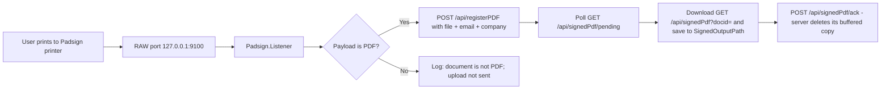
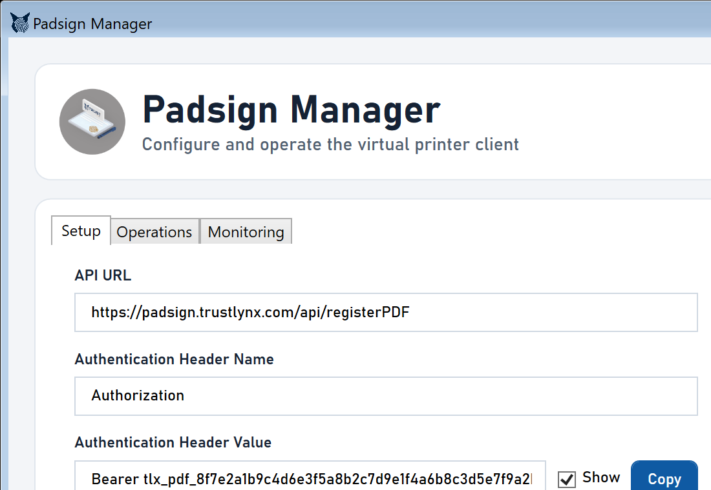
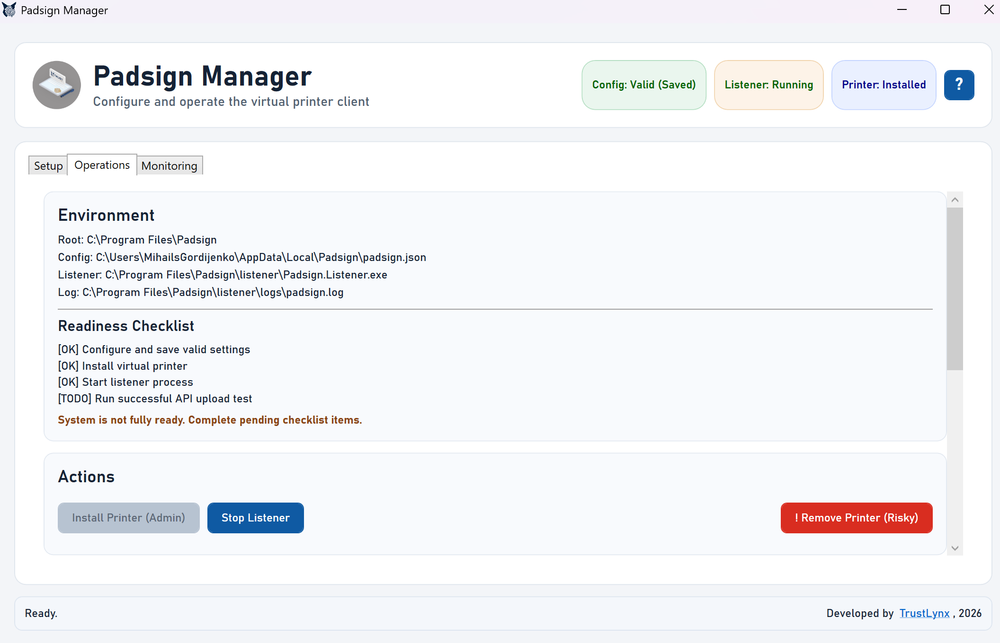
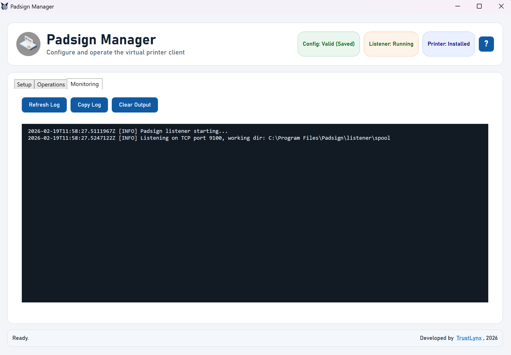
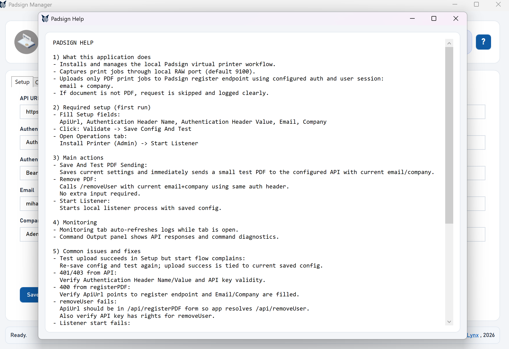

Padsign Virtual Printer Client
==============================

This solution installs a virtual printer named `Padsign` on Windows and uploads print jobs to Padsign API when the incoming print payload is already a PDF.

No manual config-file editing is required for end users. All operational fields are editable in the desktop app (`Padsign Manager`).

Getting the Installer
---------------------
The only file the end user needs is `Padsign-Setup.cmd`. Pick one of the direct download links below (both point to the current `main` branch and serve the same file):

- GitLab (recommended for external delivery):
  https://gitlab.com/trustlynx-public/padsign-virtual-driver/-/raw/main/out/installer/Padsign-Setup.cmd?inline=false
- GitHub mirror:
  https://github.com/mihailsgo/padsign-virtual-driver/raw/main/out/installer/Padsign-Setup.cmd

Expected file size is around 293 KB (approximately 292 to 300 KB). Run the file as Administrator on Windows.

To verify the version after installation, the Manager window title should read `Padsign Manager vX.Y.Z` (current release is `v1.2.0`).

Alternatively, clone the repository and find the file at `out/installer/Padsign-Setup.cmd`.

To rebuild the installer from source:
```powershell
powershell -ExecutionPolicy Bypass -File scripts/create-setup.ps1
```

Changelog
---------
- **v1.2.0** — Signed-PDF receive-back. After a print job is uploaded, the listener polls the PadSign server for the signed PDF, downloads it to the configured **Signed Output Folder** (`SignedOutputPath`, default `D:\VM\SignedDocs`) under the server-provided filename, then acknowledges delivery (the server deletes its copy). Adds: a one-time startup catch-up; a `Signed Output Folder` field in the Setup tab; new config fields `ReceiveBackEnabled` / `ReceiveBackPollSeconds` (default 5) / `ReceiveBackTimeoutMinutes` (default 30); and a `Receive-back` status chip in the header. Failed acks are retried without re-downloading. Endpoints used (same `REGISTER_PDF_API_KEY` auth): `GET /api/signedPdf/pending`, `GET /api/signedPdf`, `POST /api/signedPdf/ack`.
- **v1.1.0** — Initial release. Virtual printer that captures Windows print jobs, detects PDF content, and uploads to the PadSign server (`POST /api/registerPDF`, API-key auth, `source=virtual-printer`). WPF Manager for configuration (API URL, auth, email, company), printer install/remove, listener start/stop, live log monitoring, and test upload with auto-cleanup.

Quick Installation Guide
------------------------
1. Right-click `Padsign-Setup.cmd` and choose **Run as administrator** (required for printer installation).
2. In installer options:
   - choose installation folder
   - choose whether to create desktop shortcut
3. After install, open `Padsign Manager` from desktop shortcut, or run executable directly:
   - default full path:
     - `C:\Program Files\Padsign\manager\Padsign.Manager.exe`
   - if custom install folder was selected:
     - `<YourInstallFolder>\manager\Padsign.Manager.exe`
4. In `Setup` tab, fill required fields and click `Save And Test PDF Sending`.
5. In `Operations` tab, click `Start Listener`.
6. Print to the `Padsign` printer.

Notes:
- Admin rights are required for installation/printer operations.
- Daily use (editing config, monitoring logs, testing API) is done from `Padsign Manager`.

Upgrading From a Previous Version
---------------------------------
Installing a newer build over an existing one (for example `v1.1.0` → `v1.2.0`) is an
in-place upgrade. Run the same `Padsign-Setup.cmd` as administrator and install to the
**same folder** as before.

What the installer does:
- Stops the running `Padsign.Listener` and `Padsign.Manager` so their files can be replaced.
- Overwrites the program binaries with the new version.
- **Preserves your existing configuration.** Your settings live in
  `%LOCALAPPDATA%\Padsign\padsign.json` (outside the install folder), so the installer never
  touches them; an install-folder `config\padsign.json` is also kept if it already exists
  (the sample is only seeded on a first install).
- Re-registers the `Padsign` printer and relaunches the Manager.

What happens to configuration:
- All existing fields (API URL, auth, email, company, port, …) are read unchanged — the
  print → upload flow is fully backward-compatible.
- Fields introduced in a newer version that are missing from your old `padsign.json` take
  their built-in defaults. For `v1.2.0` these are: `ReceiveBackEnabled = true`,
  `SignedOutputPath = D:\VM\SignedDocs`, `ReceiveBackPollSeconds = 5`,
  `ReceiveBackTimeoutMinutes = 30`. They are written into the file the next time you click
  `Save And Test PDF Sending`.

What changes in behavior after upgrading to `v1.2.0`:
- **Receive-back is enabled by default.** The listener will poll the server for the signed
  PDF after each upload (and once at startup). This is safe: if the server does not yet expose
  the receive-back endpoints (older `ps-server`) or routing is off, the poll just logs and does
  nothing — **printing and upload are unaffected**.
- If the desktop has no `D:` drive, nothing happens until a document is actually returned; only
  then is the save attempted and, if the folder cannot be created, the failure is logged and the
  server keeps the file for retry (no crash). Set a real path in the Setup tab's
  **Signed Output Folder** to avoid this.

Recommended steps:
1. Run `Padsign-Setup.cmd` as administrator → install to the same folder.
2. Open `Padsign Manager`, confirm the title reads `Padsign Manager v1.2.0`.
3. In the `Setup` tab, set **Signed Output Folder** to a real local path and click
   `Save And Test PDF Sending` (this rewrites `padsign.json` with the new fields).
4. To opt a desktop **out** of receive-back, set `"ReceiveBackEnabled": false` in
   `%LOCALAPPDATA%\Padsign\padsign.json` (there is no UI toggle), then start the listener.

Visual Architecture
-------------------

```mermaid
flowchart LR
  A[User prints to Padsign printer] --> B[RAW port 127.0.0.1:9100]
  B --> C[Padsign.Listener]
  C --> D{Payload is PDF?}
  D -- Yes --> E[POST /api/registerPDF with file + email + company]
  D -- No --> F[Log: document is not PDF; upload not sent]
  E --> G[Poll GET /api/signedPdf/pending]
  G --> H[Download GET /api/signedPdf?docid= and save to SignedOutputPath]
  H --> I[POST /api/signedPdf/ack - server deletes its buffered copy]
```

UI Map (What Client Sees)
-------------------------
- Header chips:
  - `Config: ...`
  - `Listener: Running/Stopped`
  - `Printer: Installed/Missing`
  - `Receive-back: delivered/pending/failed/idle/off` (last signed-PDF return status; full reason in tooltip)
- Tabs:
  - `Setup`: fill API/auth/session values and click `Save And Test PDF Sending`.
  - `Operations`: install/remove printer, start/stop listener, readiness checklist, command output.
  - `Monitoring`: live log tail, copy log, clear output.
- Help:
  - `?` button in top-right opens built-in troubleshooting guide.

Detailed Tab Guide
------------------
Setup Tab
- Purpose:
  - configure API/auth/session values and verify upload before starting listener.
- Left-side fields:
  - `API URL`
  - `Authentication Header Name`
  - `Authentication Header Value` with `Show` checkbox and `Copy` button
  - `Email`
  - `Company`
- Right-side fields:
  - `RAW Port`
  - `Working Directory`
  - `Signed Output Folder`
  - `Upload Timeout Seconds`
  - `Max Upload Retries`
  - `Retry Backoff Seconds`
  - `Cleanup spool files after successful upload`
- Actions:
  - `Save And Test PDF Sending`:
    - validates input
    - persists configuration to both user config and listener config paths
    - sends a test PDF upload with current `email + company`
    - automatically removes the test document from the server on success
    - auto-restarts the listener if it was running (so config changes take effect immediately)
    - returns friendly error category plus technical details on failure
- Setup status texts:
  - save state (`Unsaved changes` or `Saved`)
  - last upload test state (`success/failed/not run`)

Operations Tab
- Purpose:
  - runtime control plane for printer/listener and operational checks.
- Environment card:
  - shows resolved paths for root, config, listener executable, and log file.
- Readiness checklist:
  - config is valid and saved
  - printer is installed
  - listener process is running
  - API test upload has succeeded
- Actions section:
  - `Install Printer (Admin)`:
    - creates/repairs local Padsign printer and RAW TCP port
  - `Start Listener` / `Stop Listener`:
    - one toggle button depending on current state
  - `! Remove Printer (Risky)`:
    - removes local Padsign printer after confirmation
- Diagnostics panels:
  - `Last Operation` card summarizes latest command/action result
  - `Command Output` shows command/API diagnostics details

Monitoring Tab
- Purpose:
  - real-time log visibility and support diagnostics.
- Behavior:
  - auto-refreshes while Monitoring tab is open
  - shows listener log tail in a console-style panel
- Actions:
  - `Refresh Log`
  - `Copy Log`
  - `Clear Output`
- Recommended usage:
  - open this tab during first print tests to confirm upload flow and errors.

Screenshots
-----------
Use these names for client screenshots in this README:
- `docs/images/setup-tab.png`
- `docs/images/operations-tab.png`
- `docs/images/monitoring-tab.png`
- `docs/images/help-window.png`

When image files are added, include:

### Setup Tab


### Operations Tab


### Monitoring Tab


### Help Window


Install and First Run (Client)
------------------------------
1. Download `Padsign-Setup.cmd` from one of the direct links in the "Getting the Installer" section above and run as Administrator.
2. In setup window:
   - choose installation folder
   - choose whether to create desktop shortcut
3. App opens `Padsign Manager`.
   - direct executable path (default):
     - `C:\Program Files\Padsign\manager\Padsign.Manager.exe`
   - listener executable path (default):
     - `C:\Program Files\Padsign\listener\Padsign.Listener.exe`
4. In `Setup` tab fill:
   - `ApiUrl`
   - `Authentication Header Name`
   - `Authentication Header Value`
   - `Email`
   - `Company`
5. Click `Save And Test PDF Sending`.
6. Open `Operations` tab and click `Start Listener`.
7. Print to printer `Padsign`.

Required Fields
---------------
- `ApiUrl`
- `AuthenticationHeaderName`
- `AuthenticationHeaderValue`
- `Email`
- `Company`

Advanced Fields
---------------
- `Port` (default `9100`)
- `WorkingDirectory` (default `spool`)
- `SignedOutputPath` (default `D:\VM\SignedDocs`)
- `UploadTimeoutSeconds`
- `MaxUploadRetries`
- `RetryBackoffSeconds`
- `CleanupOnSuccess`
- `ReceiveBackEnabled` (default `true`)
- `ReceiveBackPollSeconds` (default `5`)
- `ReceiveBackTimeoutMinutes` (default `30`)

Field Reference (Detailed)
--------------------------
`ApiUrl`
- What it is:
  - full API endpoint used for PDF upload test and runtime uploads.
- Expected value:
  - full HTTPS URL to Padsign register endpoint (example: `https://padsign.trustlynx.com/api/registerPDF`).
- Why it matters:
  - wrong URL causes upload failure (`400/404/connection`).

`AuthenticationHeaderName`
- What it is:
  - HTTP header key used for authorization.
- Expected value:
  - usually `Authorization` unless your API gateway expects a custom key.
- Why it matters:
  - wrong header name means token is not recognized (`401/403`).

`AuthenticationHeaderValue`
- What it is:
  - token or credential value sent in the auth header.
- Expected value:
  - usually `Bearer <token>` format.
- Why it matters:
  - missing/expired/invalid token causes auth failures (`401/403`).
- UI helpers:
  - `Show` checkbox reveals/hides value.
  - `Copy` button copies current value.

`Email`
- What it is:
  - user session identity part 1.
- Expected value:
  - valid user email (example: `name@company.com`).
- Why it matters:
  - sent with each upload to identify the user session.

`Company`
- What it is:
  - user session identity part 2.
- Expected value:
  - company/tenant value exactly as expected by backend.
- Why it matters:
  - combined with email to target the correct user session.

`Port` (`RAW Port`)
- What it is:
  - local TCP port where virtual printer sends RAW print stream.
- Default:
  - `9100`.
- Why it matters:
  - printer port and listener port must match; mismatch means listener receives nothing.

`WorkingDirectory`
- What it is:
  - local folder used by listener for spool/temp job files.
- Default:
  - `spool`.
- Why it matters:
  - ensure write permissions; invalid path may break job processing.

`SignedOutputPath` (`Signed Output Folder`)
- What it is:
  - local folder where the signed PDF returned by the server is saved.
- Default:
  - `D:\VM\SignedDocs`.
- Why it matters:
  - created automatically if missing; the file is named by the server
    (`<documentNumber>_<timestamp>.pdf`, taken from the `X-Padsign-Filename`
    header). Must be a full/rooted, writable path (validated in the UI).

`ReceiveBackEnabled`
- What it is:
  - master switch for pulling signed PDFs back to this desktop.
- Default:
  - `true`. Set `false` to disable receive-back entirely (config-file only).

`ReceiveBackPollSeconds`
- What it is:
  - interval between `/signedPdf/pending` polls after an upload.
- Default:
  - `5`.

`ReceiveBackTimeoutMinutes`
- What it is:
  - how long a per-job poll waits for its document before giving up (the doc is
    still delivered later by startup catch-up).
- Default:
  - `30`.

`UploadTimeoutSeconds`
- What it is:
  - max wait time for one API request.
- Typical value:
  - `30`.
- Why it matters:
  - too low can fail slow networks; too high delays visible failure feedback.

`MaxUploadRetries`
- What it is:
  - retry count for failed uploads.
- Typical value:
  - `3`.
- Why it matters:
  - improves reliability for transient network/API issues.

`RetryBackoffSeconds`
- What it is:
  - delay between retry attempts.
- Typical value:
  - `2`.
- Why it matters:
  - prevents immediate rapid-fire retries against unstable endpoints.

`CleanupOnSuccess` (`Cleanup spool files after successful upload`)
- What it is:
  - whether local spool artifacts are deleted after successful upload.
- Recommended:
  - enabled for cleaner disk usage; disabled only when debugging is needed.

What Buttons Do
---------------
`Save And Test PDF Sending`
- validates all fields, saves config to both paths, sends test upload, and auto-removes test document from server on success.
- if the listener is running, it is automatically restarted with the updated configuration.

`Start Listener` / `Stop Listener`
- starts or stops local listener process that receives print jobs from printer port.

`Install Printer (Admin)`
- creates/repairs Padsign virtual printer and RAW port mapping.

`! Remove Printer (Risky)`
- removes local Padsign printer; use only when uninstalling/troubleshooting.

Runtime Behavior
----------------
- PDF payload:
  - uploaded to Padsign API (`registerPDF`) with `file`, `email`, `company`.
- Non-PDF payload:
  - request is not sent
  - listener logs: `document is not PDF. Upload request has not been made.`
- Startup auto-test:
  - on launch, if configuration is valid and saved, the Manager automatically runs a connectivity test (upload + cleanup) and updates the readiness checklist.
- Receive-back (signed PDF returns to this desktop):
  - after a successful upload, the listener polls the server for the signed result, saves it to `SignedOutputPath` under the server-provided filename, then acknowledges delivery (which deletes the server's buffered copy).
  - at listener startup, a one-time catch-up delivers any documents that were signed while the Manager was closed.
  - status appears in the `Receive-back` header chip; per-step detail is in the listener log. A failed acknowledgement keeps the local file and retries later without re-downloading.

Status and Readiness
--------------------
Operations tab checklist expects all to be true:
- valid and saved configuration
- virtual printer installed
- listener running
- successful API test upload in current config context

Troubleshooting (Client-Friendly)
---------------------------------
- `Could not connect`:
  - API URL unavailable, DNS/network issue, firewall/proxy issue.
- `Authorization error` (`401/403`):
  - header name/value invalid or expired token.
- `Bad request` (`400`):
  - check URL endpoint and `email/company` values.
- `Listener executable not found`:
  - broken installation; reinstall with latest package.
- Printer installed but button flow inconsistent:
  - reopen app; statuses refresh automatically.

Config and Logs
---------------
- Main config:
  - `%LOCALAPPDATA%\Padsign\padsign.json`
- Listener config copy:
  - `<install folder>\listener\padsign.json`
- Listener logs:
  - `<install folder>\listener\logs\padsign.log`
- Receive-back state (in the listener working directory, default `<install folder>\listener\spool`):
  - `receiveback-status.json` — last receive-back outcome shown in the Manager chip
  - `received-pending-ack.json` — docs saved locally but not yet acknowledged (ack retried later)

Build and Packaging (Internal)
------------------------------
Create single-file installer:
- `powershell -NoProfile -ExecutionPolicy Bypass -File .\scripts\create-setup.ps1`

Create client delivery folder:
- `powershell -NoProfile -ExecutionPolicy Bypass -File .\scripts\create-client-package.ps1`

Output:
- `out\client-package\Padsign-Client-<timestamp>\Padsign-Setup.cmd`
- `out\client-package\Padsign-Client-<timestamp>\README-CLIENT.txt`
- `out\client-package\Padsign-Client-<timestamp>\SHA256SUMS.txt`

Project Files
-------------
- `src/Padsign.Listener/` - listener/uploader runtime
- `src/Padsign.Manager/` - WPF desktop UI
- `scripts/install-printer.ps1` - printer installation
- `scripts/remove-printer.ps1` - printer removal
- `scripts/create-setup.ps1` - installer packaging
- `scripts/create-client-package.ps1` - client bundle packaging
- `config/padsign.sample.json` - default config template
